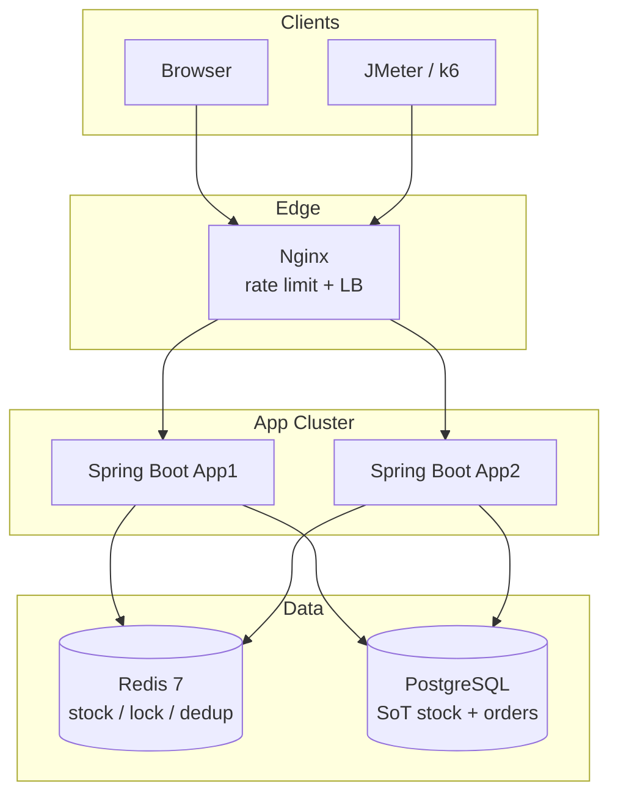
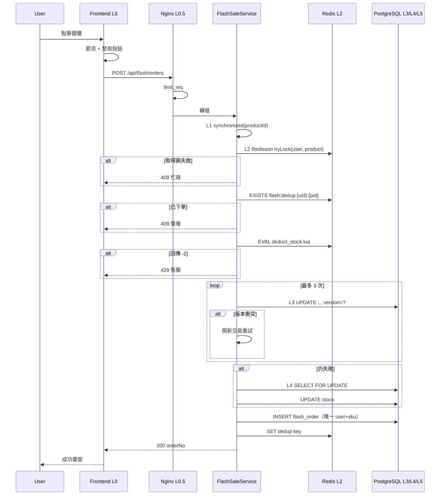

# 系統架構與鎖策略

## 1. 整體架構

```text
┌──────────────────────────────────────────────────────────────┐
│                    用戶端（瀏覽器 / JMeter）                   │
│  第 0 層：按鈕禁用 + 1 秒節流 + 2 秒冷卻                      │
└──────────────────────────┬───────────────────────────────────┘
                           │ HTTP
                           ▼
┌──────────────────────────────────────────────────────────────┐
│                    Nginx（反向代理）                           │
│  第 0.5 層：limit_req_zone 每 IP 100 req/s                    │
│  upstream: app1、app2（輪詢）                                 │
└────────────┬─────────────────────────────┬────────────────────┘
             │                             │
     ┌───────▼───────┐             ┌───────▼───────┐
     │    App 節點 A  │             │    App 節點 B  │
     │               │             │               │
     │  第 1 層：     │             │  第 1 層：     │
     │  synchronized │             │  synchronized │
     │  （JVM 本機）  │             │  （JVM 本機）  │
     │               │             │               │
     │  第 2 層：     │◄───Redis───►│  第 2 層：     │
     │  Redisson     │             │  Redisson     │
     │  + Lua 庫存   │             │  + Lua 庫存   │
     │               │             │               │
     │  第 3 層：     │             │  第 3 層：     │
     │  @Version     │             │  @Version     │
     │               │             │               │
     │  第 4 層：     │             │  第 4 層：     │
     │  FOR UPDATE   │             │  FOR UPDATE   │
     └───────┬───────┘             └───────┬───────┘
             │                             │
             └──────────┬──────────────────┘
                        │
               ┌────────▼────────┐
               │   PostgreSQL    │
               │ 庫存 · 訂單      │
               │ 唯一約束        │
               └─────────────────┘
```

### 元件圖（Mermaid）



---

## 2. 五層鎖策略

### 第 0 層 — 前端防重複

```javascript
let isClicking = false;
btn.addEventListener('click', async () => {
    if (isClicking) return;
    isClicking = true;
    btn.disabled = true;
    try { /* fetch API */ }
    finally {
        setTimeout(() => { isClicking = false; btn.disabled = false; }, 2000);
    }
});
```

**限制：** 僅限用戶端，可被繞過。屬 UX 層，非安全保證。

---

### 第 0.5 層 — Nginx 限流

```nginx
limit_req_zone $binary_remote_addr zone=seckill:10m rate=100r/s;

location /api/flash/orders {
    limit_req zone=seckill burst=50 nodelay;
    proxy_pass http://flash_sale;
}
```

在請求打到應用前，先以 HTTP 429 丟棄濫用 / 腳本化的瞬間流量。

---

### 第 1 層 — `synchronized` 本機鎖

```java
synchronized (("FLASH_" + productId).intern()) {
    // critical section
}
```

| 屬性 | 說明 |
|---|---|
| 原理 | 透過 `.intern()` 的字串池身分 → 每個商品共用同一個鎖物件 |
| 優點 | 最快；零網路開銷 |
| 缺點 | **僅限單個 JVM** — 雙實例各自持有自己的鎖 → 會超賣 |

**角色：** 低成本的同節點門檻，擋掉同進程內的重複請求。

---

### 第 2 層 — Redisson 分散式鎖 + Lua 庫存

#### Redisson

```java
RLock lock = redissonClient.getLock("flash:lock:" + userId + ":" + productId);
if (lock.tryLock(3, 10, TimeUnit.SECONDS)) {
    try { /* business */ }
    finally {
        if (lock.isHeldByCurrentThread()) lock.unlock();
    }
}
```

| 參數 | 值 | 意義 |
|---|---|---|
| `waitTime` | 3s | 取得鎖的最大等待時間 |
| `leaseTime` | 10s | 自動過期（持有期間由 Watch Dog 續期） |

#### Lua 原子扣庫存

```lua
-- 回傳 -1 未預熱、-2 庫存不足、>=0 扣減成功後剩餘
local stock = tonumber(redis.call('GET', KEYS[1]))
if not stock then return -1 end
if stock < qty then return -2 end
return redis.call('DECRBY', KEYS[1], qty)
```

| 回傳值 | 意義 |
|---|---|
| `-1` | 未預熱 |
| `-2` | 售罄 / 庫存不足（未做任何變更） |
| `>= 0` | 成功；剩餘庫存（**最後一件回傳 0**） |

Redis 以單執行緒執行 Lua → GET 與 DECRBY 之間無 TOCTOU 競態。

---

### 第 3 層 — JPA `@Version` 樂觀鎖

```java
@Version
private Integer version;
```

產生的 SQL 形狀：

```sql
UPDATE flash_sale_product
SET flash_stock = ?, version = version + 1
WHERE id = ? AND version = ?
```

| 屬性 | 說明 |
|---|---|
| 衝突 | `OptimisticLockingFailureException` |
| 重試 | 每次嘗試開新交易，最多 3 次 |
| 優點 | 低衝突下不加行鎖 |
| 缺點 | 高衝突下頻繁重試；需要兜底機制 |

---

### 第 4 層 — `SELECT FOR UPDATE` 悲觀鎖兜底

```java
@Lock(LockModeType.PESSIMISTIC_WRITE)
@Query("SELECT f FROM FlashSaleProduct f WHERE f.id = :id")
Optional<FlashSaleProduct> findByIdWithPessimisticLock(@Param("id") Long id);
```

僅在樂觀鎖重試耗盡後使用，持有行鎖直到提交。

---

### 第 5 層 — 資料庫唯一約束

```sql
CONSTRAINT uk_user_flash UNIQUE (user_id, flash_product_id)
```

若 Redis 防重遺失、或併發路徑繞過應用檢查時的最後一道安全網。

---

## 3. 下單時序



---

## 4. Redis Key 設計

| Key 樣式 | 型別 | TTL | 用途 |
|---|---|---|---|
| `flash:stock:{pid}` | String（整數） | 至場次結束 | 熱庫存計數器 |
| `flash:lock:{uid}:{pid}` | Redisson RLock | 約 10s | 每人互斥鎖 |
| `flash:dedup:{uid}:{pid}` | String（orderNo） | 至場次結束 | 冪等標記 |
| `lock:test:{pid}` | Redisson RLock | demo | 僅第 5 階段實驗用 |

---

## 5. 一致性模型

```text
                    成功路徑
  Redis DECR  ──►  DB 扣庫存  ──►  INSERT 訂單  ──►  SET dedup
       │                │                │
       │                └─ 失敗 ─────────┴──► INCR Redis（回補）
       │
       └─ 未預熱 (-1) ──► 跳過 Redis，僅走 DB 路徑
```

- **唯一事實來源：** PostgreSQL 的 `flash_sale_product.flash_stock` 與 `flash_order`
- **熱路徑加速器：** Redis 庫存（開賣前必須預熱）
- **回補：** 若 Redis DECR 後 DB 路徑失敗 → `INCR` 將庫存加回

---

## 6. 部署拓樸

### 開發（單進程）

```text
:8080 App  →  localhost Redis  →  localhost PostgreSQL
```

### 作品集 Demo（compose）

```text
:80 Nginx ─┬→ app1 ─┬→ redis
           └→ app2 ─┴→ postgres
```

證明第 2 層（Redisson）的必要性：單靠第 1 層在 app1/app2 之間會超賣。

---

## 7. 鎖機制比較表

| 機制 | 多實例 | 吞吐 | 複雜度 | 扮演角色 |
|---|---|---|---|---|
| `synchronized` | 否 | 最高（本機） | 低 | L1 門檻 |
| Redisson 鎖 | 是 | 中 | 中 | L2 互斥 |
| Lua 庫存 | 是 | 非常高 | 中 | L2 熱計數 |
| `@Version` | 是 | 高（低衝突） | 中 | L3 預設 DB |
| `FOR UPDATE` | 是 | 等待時較低 | 低 | L4 兜底 |
| 唯一索引 | 是 | 不適用 | 低 | L5 硬保證 |
