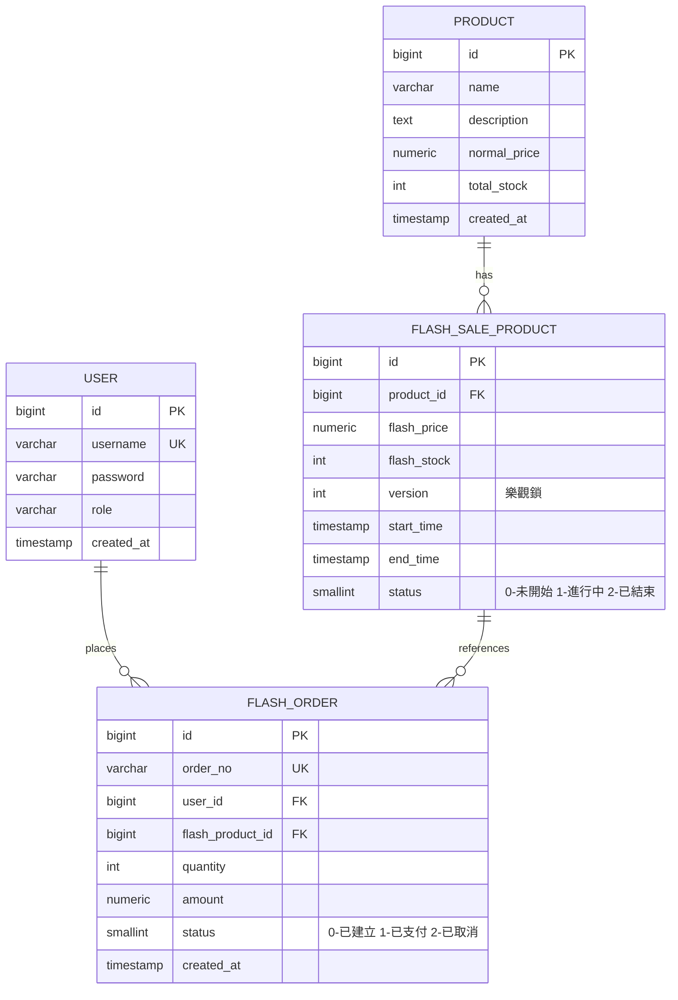

# 資料庫設計

> 資料庫：**PostgreSQL 15+**（預設 port `5432`）

## ERD



## 完整 DDL

```sql
-- 先建立資料庫（用 postgres 帳號連線）
CREATE DATABASE flash_sale;

-- 連進 flash_sale 後執行：
CREATE TABLE IF NOT EXISTS "user" (
    id         BIGSERIAL PRIMARY KEY,
    username   VARCHAR(64)  NOT NULL UNIQUE,
    password   VARCHAR(255) NOT NULL,
    role       VARCHAR(32)  NOT NULL DEFAULT 'USER',
    created_at TIMESTAMP    NOT NULL DEFAULT CURRENT_TIMESTAMP
);

CREATE TABLE IF NOT EXISTS product (
    id           BIGSERIAL PRIMARY KEY,
    name         VARCHAR(255)   NOT NULL,
    description  TEXT,
    normal_price NUMERIC(10,2)  NOT NULL,
    total_stock  INT            NOT NULL DEFAULT 0,
    created_at   TIMESTAMP      NOT NULL DEFAULT CURRENT_TIMESTAMP
);

CREATE TABLE IF NOT EXISTS flash_sale_product (
    id          BIGSERIAL PRIMARY KEY,
    product_id  BIGINT        NOT NULL UNIQUE,
    flash_price NUMERIC(10,2) NOT NULL,
    flash_stock INT           NOT NULL,
    version     INT           NOT NULL DEFAULT 0,
    start_time  TIMESTAMP     NOT NULL,
    end_time    TIMESTAMP     NOT NULL,
    status      SMALLINT      NOT NULL DEFAULT 0
);

CREATE INDEX IF NOT EXISTS idx_time_status
    ON flash_sale_product (start_time, end_time, status);

CREATE TABLE IF NOT EXISTS flash_order (
    id                BIGSERIAL PRIMARY KEY,
    order_no          VARCHAR(64)   NOT NULL UNIQUE,
    user_id           BIGINT        NOT NULL,
    flash_product_id  BIGINT        NOT NULL,
    quantity          INT           NOT NULL DEFAULT 1,
    amount            NUMERIC(10,2) NOT NULL,
    status            SMALLINT      NOT NULL DEFAULT 0,
    created_at        TIMESTAMP     NOT NULL DEFAULT CURRENT_TIMESTAMP,
    CONSTRAINT uk_user_flash UNIQUE (user_id, flash_product_id)
);

CREATE INDEX IF NOT EXISTS idx_user_id ON flash_order (user_id);
CREATE INDEX IF NOT EXISTS idx_flash_product_id ON flash_order (flash_product_id);
CREATE INDEX IF NOT EXISTS idx_created_at ON flash_order (created_at);
```

## 索引策略

| 表 | 索引 | 型態 | 目的 |
|---|---|---|---|
| `"user"` | `username` | UNIQUE | 登入查詢 |
| `flash_sale_product` | `product_id` | UNIQUE | 一商品只對應一個秒殺場次 |
| `flash_sale_product` | `idx_time_status` | 複合 | 查詢進行中秒殺商品 |
| `flash_order` | `order_no` | UNIQUE | 訂單查詢 |
| `flash_order` | `uk_user_flash` | UNIQUE(user_id, flash_product_id) | **一人一單防重** |
| `flash_order` | `idx_user_id` | 一般 | 我的訂單列表 |
| `flash_order` | `idx_created_at` | 一般 | 時間排序查詢 |

## 關鍵設計決策

| 設計 | 原因 |
|---|---|
| `@Version` 欄位 | JPA 樂觀鎖核心，每一筆 UPDATE 自動比對版本號 |
| `uk_user_flash` 唯一約束 | 資料庫最後一道防線，即使 Redis 漏掉也能保證一人一單 |
| 秒殺商品獨立一張表 | 與一般商品解耦，秒殺有自己的價格/庫存/時間 |
| `status` 欄位 | 管理端控制秒殺開關，避免依賴系統時間判斷 |
| `"user"` 雙引號 | `user` 是 PostgreSQL 保留字，必須加引號 |
| PostgreSQL 行級鎖 | `SELECT ... FOR UPDATE` 支援悲觀鎖 |
